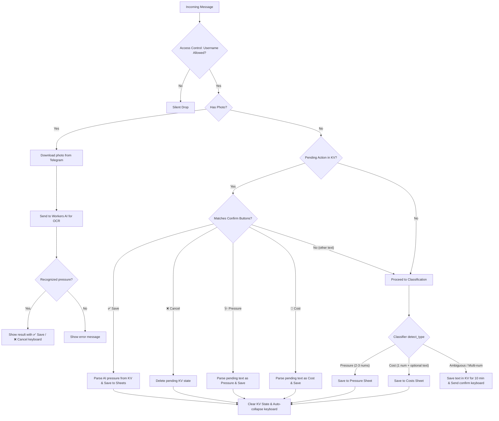

О# 🩺 Rust Cloudflare Worker: Pressure & Expense Logger

This is the **Rust (WebAssembly)** serverless version of **`pressure_bot`**, designed to be hosted as a **Cloudflare Worker** on their **Free Tier** ($0/month).

It processes incoming Telegram webhooks, parses blood pressure or expense inputs, recognizes blood pressure from photos using **Cloudflare Workers AI (llava-1.5-7b-hf / Llama 3.2 Vision)**, and securely logs them to your Google Sheets using OAuth2 credentials—all with **~0ms cold starts** and highly optimized **KV-caching** for access tokens.

---

## ⚡ Features & Enhancements in Rust

1.  **📸 AI Photo Recognition:** Send a photo of your blood pressure monitor — the bot automatically extracts systolic, diastolic, and pulse using **Cloudflare Workers AI** (`@cf/llava-hf/llava-1.5-7b-hf` or `@cf/meta/llama-3.2-11b-vision-instruct`).
2.  **💾 Serverless State Management:** Replaces the Go in-memory map with **Cloudflare KV**, making the entire bot completely stateless and scalable.
3.  **🛡️ Low CPU Footprint OAuth2 Caching:** Google Sheets API OAuth tokens are cached in Cloudflare KV with a 55-minute expiration. This drops average request CPU times down to **< 5ms** and ensures you stay safely under the free tier execution limits.
4.  **📦 Zero Heavy Crypto Bloat:** Uses the pure-Rust `jwt-simple` crate for fast Wasm-compatible RS256 token signing.
5.  **⏱️ Embedded Timezone Support:** Statically embeds timezone databases using Wasm-compatible `chrono-tz`, preserving your precise local logging times (e.g. `Europe/Kiev`).
6.  **🌐 Cyrillic Sheets & Custom Range Encoding:** Implements native percent-encoding and automatic single-quote range escaping, handling Cyrillic tab names with spaces and parentheses (like `'Значения (2026 )'!A3`) perfectly.
7.  **📢 Direct Telegram Error Reporting:** Instantly forwards Google Sheets API errors directly to your Telegram chat to prevent silent failures.
8.  **⌨️ Automatic Keyboard Management:** Seamlessly collapses and hides the Telegram custom keyboard when operations are completed or canceled.

---

## 🧠 Operation Logic & Message Processing Flow

The bot runs a completely stateless, deterministic decision pipeline for every incoming message. Below is the exact step-by-step logic:



### 1. Photo Recognition Flow
When a user sends a photo:
- The bot downloads the largest photo variant from Telegram servers
- Encodes it and sends to **Cloudflare Workers AI** with a specialized prompt for blood pressure extraction
- Parses the AI response to extract **systolic**, **diastolic**, and optionally **pulse** values
- Shows the recognized values with **✅ Save** / **❌ Cancel** keyboard buttons
- On ✅ Save: saves to Google Sheets Pressure tab
- On ❌ Cancel: removes pending data from KV store

### 2. Security & Access Check
Every request received at `/webhook` is authenticated. The bot verifies that the message sender's Telegram username matches the secure `ALLOWED_USERNAME` secret. Unauthorized messages are discarded instantly.

### 3. Session Lookup (Cloudflare KV)
The bot checks Cloudflare KV under the sender's `chat_id` key for any previously stored ambiguous messages:
*   If a pending text exists and the user clicked **🩺 Pressure** or **💸 Cost**, the bot executes the respective action on the *stored pending text*, clears the KV state, and collapses the reply keyboard.
*   If the user clicked **❌ Cancel**, the KV state is cleared, and the keyboard is collapsed.
*   If the user sends any other message, it falls through to new input classification.

### 4. Smart Classifier (`detect_type`)
If there is no pending session (or if the input fell through), the text is processed by a highly optimized parser:
*   **🩺 Blood Pressure:** Matches if the text contains exactly **2 or 3 numbers** separated by spaces, slashes, or vertical bars (e.g., `120 80`, `130/80/70`), where numbers fit biological boundaries (systolic 80-250, diastolic 40-150, pulse 40-200). Logged to the **Pressure** tab with a timestamp.
*   **💸 Expense / Cost:** Matches if the text contains exactly **1 number** and optional text comments (e.g., `250 taxi`, `500`). Logged to the **Costs** tab with a date.
*   **❓ Ambiguous:** If the input doesn't fit either pattern (e.g., multiple numbers with text), the bot stores the raw input text in KV (with a 10-minute expiration TTL) and responds with a selection keyboard asking: *"Where to save?"*.

---

## 🚀 Step-by-Step Setup & Deployment

### 1. Provision Cloudflare KV Namespace
Create the KV store namespace on Cloudflare to manage your active state and token caching:
```bash
npx wrangler kv namespace create STATE_STORE
```
*Note: If you plan on testing locally, also create a preview namespace:*
```bash
npx wrangler kv namespace create STATE_STORE --preview
```

Open your **[wrangler.toml](file:///home/alex/pressure_bot_rust/wrangler.toml)** and replace the `id` (and optionally `preview_id`) values with the output from the commands above:

```toml
[[kv_namespaces]]
binding = "STATE_STORE"
id = "YOUR_PRODUCTION_KV_NAMESPACE_ID"
preview_id = "YOUR_PREVIEW_KV_NAMESPACE_ID"  # (Optional)
```

---

### 2. Configure Cloudflare Secrets
Secrets are securely encrypted environment variables managed by Cloudflare. Run the following commands to add your configurations:

```bash
# Your Telegram Bot token from @BotFather
npx wrangler secret put BOT_TOKEN

# The Telegram username allowed to interact with the bot (without the @)
npx wrangler secret put ALLOWED_USERNAME

# The Google Spreadsheet ID
npx wrangler secret put SHEET_ID

# The full, raw JSON key contents of your Google Cloud Service Account
npx wrangler secret put GOOGLE_CREDENTIALS_JSON

# (Required for Photo Recognition) Cloudflare Account ID
npx wrangler secret put CLOUDFLARE_ACCOUNT_ID

# (Required for Photo Recognition) Cloudflare API Token with Workers AI access
npx wrangler secret put CLOUDFLARE_API_TOKEN

# (Optional Secrets) Custom Sheets and Timezone configurations
npx wrangler secret put PRESSURE_SHEET
npx wrangler secret put PRESSURE_SHEET_ID
npx wrangler secret put COSTS_SHEET
npx wrangler secret put COSTS_SHEET_ID
npx wrangler secret put TIMEZONE
```

### AI Vision Model (Optional)
By default the bot uses `@cf/meta/llama-3.2-11b-vision-instruct` (requires accepting the license). To use a different model, add as environment variable or secret:
```bash
npx wrangler secret put AI_VISION_MODEL
# Value: @cf/llava-hf/llava-1.5-7b-hf
```

---

### 3. Build and Deploy
Wrangler will automatically download the required Rust target, compile your code to WebAssembly (`wasm32-unknown-unknown`), optimize the binary, and deploy it globally:

```bash
npx wrangler deploy
```

Once the deployment completes, Wrangler will output your worker's live URL (e.g., `https://pressure-bot-rust.username.workers.dev`).

---

### 4. Register the Telegram Webhook
To route your bot messages to the deployed Cloudflare Worker, point your Telegram bot webhook to your worker's `/webhook` endpoint:

```bash
curl -F "url=https://<YOUR_WORKER_URL>/webhook" https://api.telegram.org/bot<YOUR_BOT_TOKEN>/setWebhook
```

To verify that the webhook was successfully set:
```bash
curl https://api.telegram.org/bot<YOUR_BOT_TOKEN>/getWebhookInfo
```

---

## 📂 Project Structure

```
├── Cargo.toml         # Optimized dependency tree (worker, base64, jwt-simple, chrono)
├── wrangler.toml      # KV bindings, AI binding, build targets, metadata
├── src/
│   ├── lib.rs         # Pure Rust event handler, parsing engine, Sheets APIs, photo flow
│   ├── telegram.rs    # Telegram API models (Update, Message, PhotoSize) and service
│   ├── parser.rs      # Text parsing: blood pressure, costs, AI response parsing
│   ├── ai_vision.rs   # Workers AI integration: photo recognition via llava/llama vision
│   ├── operations.rs  # Google Sheets operations (add_pressure, add_cost)
│   └── google.rs      # Google OAuth2 authentication and API requests
└── README.md          # Setup & instruction guide
```

---

## 🔒 Git Safety & Security Guidelines

This repository is **100% safe to commit and push to public Git hosting services (like GitHub)**! 

*   **No Hardcoded Secrets:** All private keys, tokens, and credentials (`BOT_TOKEN`, `GOOGLE_CREDENTIALS_JSON`, `CLOUDFLARE_API_TOKEN`, etc.) are stored securely in Cloudflare's dashboard/CLI as **Secrets** and are never present in the source files.
*   **Safe KV Namespace IDs:** The KV namespace `id` in `wrangler.toml` is a public binding identifier and is safe to commit to Git.
*   **Pre-configured Gitignore:** The `.gitignore` is optimized for Rust and Wrangler, automatically blocking all build artifacts (`target/`, `build/`, `.wrangler/`) and local configuration files (`.dev.vars`).

---

## 📄 License

This project is licensed under the MIT License.